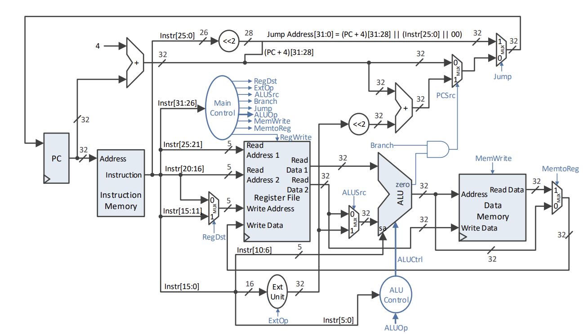

# MIPS Single-Cycle Processor (VHDL Implementation)

This project implements a single-cycle MIPS processor architecture (32-bit subset) using **VHDL** (Very High Speed Integrated Circuit Hardware Description Language). The design strictly follows the five-stage pipeline concept condensed into a single clock cycle for simplicity, showcasing the fundamental components of a CPU: Instruction Fetch, Decode, Execute, Memory, and Write Back.

## Key Features

* **MIPS Subset:** Implements essential instructions (R-type, I-type) for arithmetic, logic, and control flow (e.g., `ADD`, `SUB`, `ANDI`, `SRA`, `LW`, `SW`, `BEQ`, `J`).
* **VHDL Implementation:** Modular design with separate VHDL entities for core stages: `IFetch` (Instruction Fetch), `ID` (Instruction Decode/Register File), `EX` (Execute/ALU), `MEM` (Memory), and the main control unit.
* **Control Unit Logic:** Implements the MIPS control logic to generate the necessary control signals (`RegDst`, `ALUSrc`, `MemWrite`, `MemtoReg`, `RegWrite`, `Branch`, `Jump`) based on the instruction opcode and function code.
* **Data Persistence (Memory):** Includes a data memory model (`MEM.vhd`) initialized with an array and a dedicated test sequence to solve a specific problem (counting positive odd numbers in an array).
* **Generic Data Access:** The Instruction Decode stage (`ID.vhd`) uses a generic Register File component.

## Project Structure (VHDL Modules)

| Component | File | Description |
| :--- | :--- | :--- |
| **Instruction Fetch** | `IFetch.vhd` | Manages the Program Counter (PC) and fetches instructions from the Instruction Memory. Handles PC update logic for sequential flow, branching, and jumping. |
| **Instruction Decode** | `ID.vhd` | Implements the Register File. Decodes the instruction, reads operands from the register file, and handles immediate value extension (Sign/Zero Extend). |
| **Execute** | `EX.vhd` | Contains the **ALU** (Arithmetic Logic Unit). Selects the ALU operation based on control signals and performs the computation. |
| **Memory** | `MEM.vhd` | Contains the Data Memory component. Handles Load (`LW`) and Store (`SW`) operations based on the `MemWrite` control signal. |
| **Control Signals** | `SemnaleControlMIPS32_ALEX.docx` | Documentation detailing the control signals' values for each implemented instruction. |

## MIPS Architecture Schema

The project is built around the classic single-cycle MIPS datapath architecture. This diagram illustrates how the core components are interconnected and how data flows during execution:



## Test and Simulation

### Test Scenario

The memory initialization in `MEM.vhd` and the instruction sequence in `IFetch.vhd` are configured to execute the following program:

**Goal:** Count the number of positive, odd elements in an array of size `N`.

* **Input Data (initial memory addresses):**
  * Address 0: Result (initialized to 0)
  * Address 4: **N** (size of the array, e.g., 5)
  * Address 8: Array Base Address (`array[0]`)
* **Instructions:** Implements a loop using `LW` (Load Word), `SRA` (Shift Right Arithmetic for sign check), `ANDI` (for odd check), and `BEQ` (Branch if Equal).

### Tools and Environment

* **VHDL Tool:** Xilinx Vivado (or similar HDL simulator/synthesizer).
* **Project Files:** The repository includes project files (`test_env.xpr`) and bitstream (`test_env.bit`) generated from Vivado.

## Getting Started

1. **Clone the repository:**

```bash
git clone [Your Repository URL]
